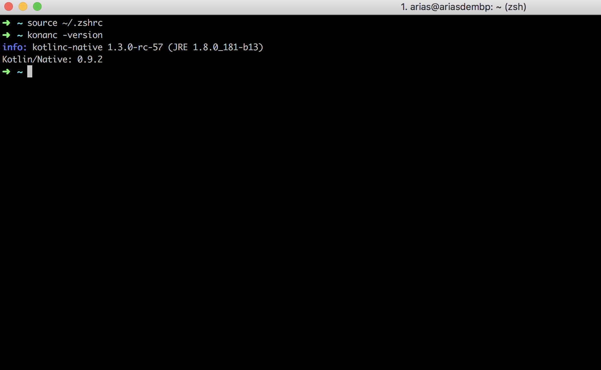
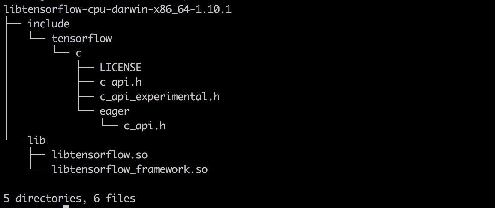
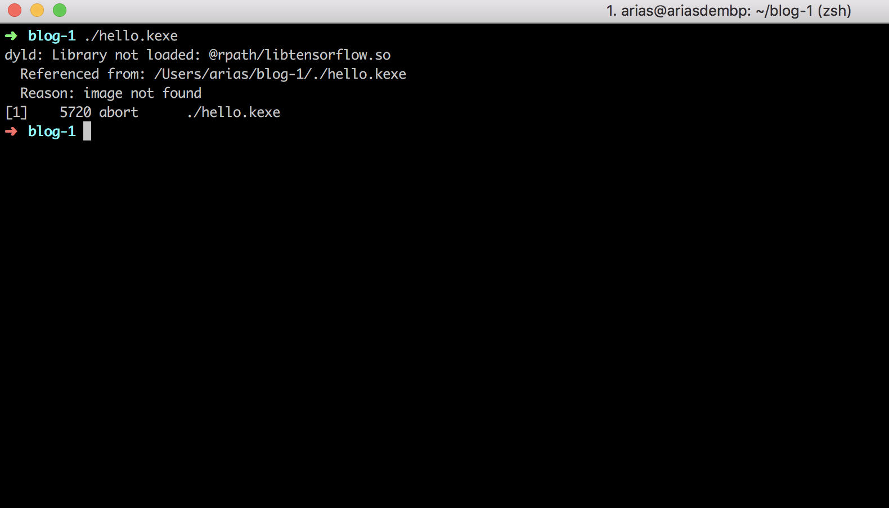
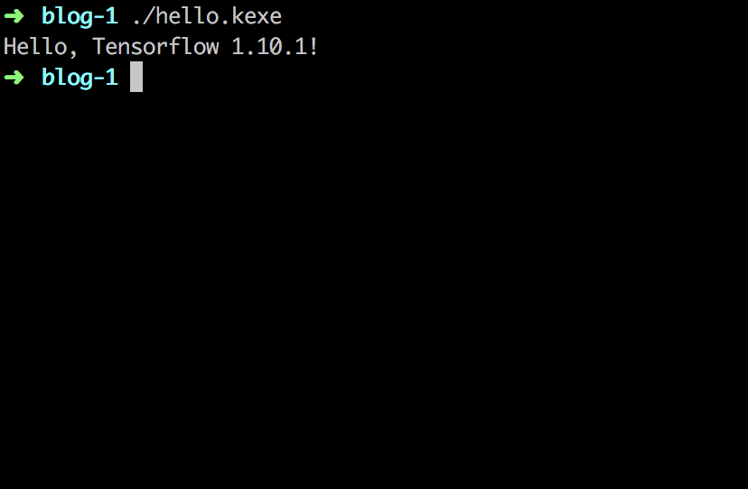
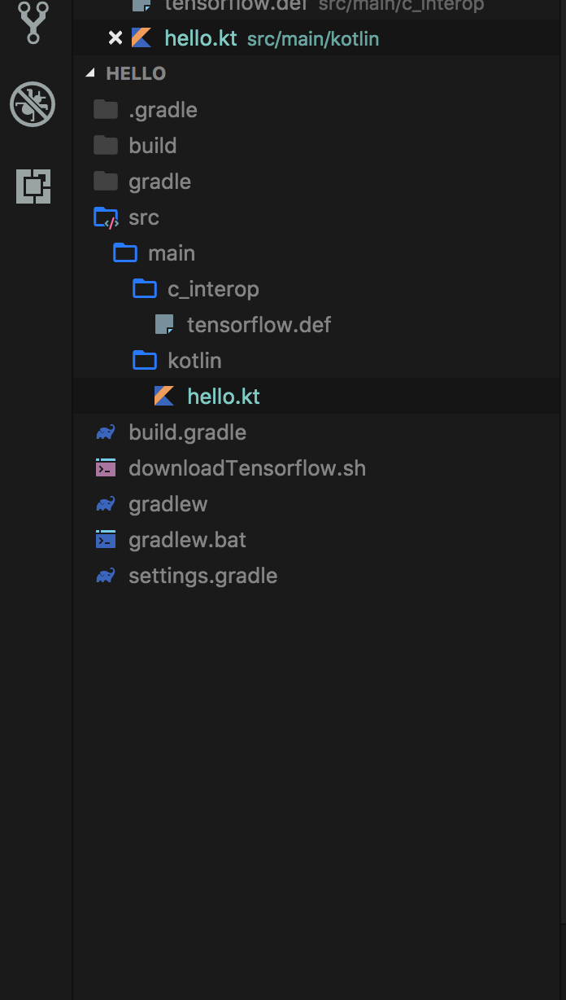

## 获取Kotlin Native编译器

前往Kotlin Native的官方[Repo](https://github.com/JetBrains/kotlin-native)的Release页面获取最新的编译器


下载解压后，为了能够在命令行中直接使用，我们需要在`~/.zshrc `中添加对应的环境变量

```shell
export KOTLIN_NATIVE_HOME=/Users/arias/.konan/kotlin-native-macos-0.9.2
export PATH=$KOTLIN_NATIVE_HOME/bin:$PATH:
```

之后`source ~/.zshrc`刷新一哈，检查是否安装成功



如果正确弹出版本信息，则安装成功了！


## 生成TensorFlow C API的klib

首先前往TensorFlow的[官网](www.tensorflow.org)获取最新的TensorFlow C API的Library，目前最新的版本为1.10.1

下载下来之后我们可以看下这个library里有什么内容



可以看到这个library包含了头文件以及对应的链接库

我们目前只需要`c_api.h`这个头文件，`c_api_experimental.h`估计是最新加入的实验性的内容，`eager/c_api.h`应该是之前tf搞得Eager Excution所需要的头文件。

我们先新建一个`tensorflow.def`文件，内容如下

```
headers = tensorflow/c/c_api
```

参考Kotlin Native的官方文档可得知，与C交互需要先使用一个叫做`cinterop`工具，这个工具根据提供的头文件会生成对应的klib。因此我们编写的这个def文件是告诉`cinterop`需要对哪些头文件进行操作

然后我们执行以下命令来生成对应的klib

```shell
cinterop -def tensorflow.def -compilerOpts -I./libtensorflow-cpu-darwin-x86_64-1.10.1/include -o tensorflow.klib
```

在获得klib之后，我们并不知道其内容是什么，于是我们可以使用`klib`来查看生成后的klib有什么东西

```shell
klib contents tensorflow.klib
```


可以看到内容多到看不完！于是我们可以导出为`*.kt`文件方便我们使用编辑器查看

```shell
klib contents tensorflow.klib > c_api.kt
```


## Hello, Tensorflow!

我们新建一个`hello.kt`文件，内容如下

```kotlin
import kotlinx.cinterop.toKString
import tensorflow.TF_Version

fun main(args: Array<String>) {
    println("Hello, Tensorflow ${TF_Version()!!.toKString()}!")
}
```

然后我们使用`konanc`编译我们的kotlin代码

```shell
konanc hello.kt -l tensorflow.klib -linker-options ./libtensorflow-cpu-darwin-x86_64-1.10.1/lib/libtensorflow.so -o hello
```

编译完成后，我们得到一个`hello.kexe`（对！就是它，后缀是`.kexe`！简直难以置信）

然后我们运行它



报错了，提示没找到libtensorflow.so。由于我们下载的TensorFlow的library并没有放在系统链接库的目录而是我们自己指定的目录，程序运行的时候会在`当前目录`以及`系统目录`去寻找所需要的动态链接库。因此，解决方案有两种：

1. 把我们下载的libtensorflow放到系统链接库中
2. 是把我们存放libtensorflow的目录加入环境变量`DYLD_LIBRARY_PATH`中（Linux则为`LD_LIBRARY_PATH`）

然后我们再次运行它



成功了！欢呼雀跃吧！


## 使用Gradle

别高兴的太早，按照上述流程走的，实在太麻烦。如果项目文件一多，头皮发麻。因此我们需要一种构建工具，来代替这些繁琐的操作。

配合JetBrains（JB公司，你懂得）发布的konan gradle plugin，我们可以很方便的使用Gradle来管理、构建我们的项目。(其实Kotlin Native官方仓库也有tensorflow的例子，本文该部分也是借鉴官方的栗子)

首先我们先`init`一个项目

然后老规矩，编写`build.gradle`

```groovy
buildscript {
    ext {
        kotlin_native_version = '0.9.2'
    }
    repositories {
        maven {
            url "https://plugins.gradle.org/m2/"
        }
    }
    dependencies {
        classpath "org.jetbrains.kotlin:kotlin-native-gradle-plugin:$kotlin_native_version"
    }
}

apply plugin: "org.jetbrains.kotlin.konan"

group "com.hiarias"
version "0.0.1"

def konanUserDir = System.getenv("KONAN_DATA_DIR") ?: "${System.getProperty("user.home")}/.konan"
def tensorflowHome = "$konanUserDir/third-party/tensorflow"

konanArtifacts {
    interop("TensorflowInterop") {
        defFile "src/main/c_interop/tensorflow.def"
        includeDirs "${tensorflowHome}/include"
        dependsOn 'downloadTensorflow'
    }
    program("hello") {
        libraries {
            artifact 'TensorflowInterop'
        }
        linkerOpts "-L${tensorflowHome}/lib -ltensorflow"
    }
}

task downloadTensorflow(type: Exec) {
    workingDir getProjectDir()
    commandLine './downloadTensorflow.sh'
}
```

`konanArtifacts`中我们定义我们需要进行的操作：

1. 与tensorflow的c_api library进行交互
2. 编译我们的程序hello

然后我们又定义了一个`downloadTensorflow`的task，用于执行我们下载library的shell脚本

`downloadTensorflow.sh`内容如下：

```shell
#!/usr/bin/env bash

KONAN_USER_DIR=${KONAN_DATA_DIR:-"$HOME/.konan"}
TF_TARGET_DIRECTORY="$KONAN_USER_DIR/third-party/tensorflow"
TF_TYPE="cpu" # Change to "gpu" for GPU support

if [ x$TARGET == x ]; then
case "$OSTYPE" in
  darwin*)  TARGET=macbook; TF_TARGET=darwin ;;
  linux*)   TARGET=linux; TF_TARGET=linux ;;
  *)        echo "unknown: $OSTYPE" && exit 1;;
esac
fi

if [ ! -d $TF_TARGET_DIRECTORY/include/tensorflow ]; then
 echo "Installing TensorFlow into $TF_TARGET_DIRECTORY ..."
 mkdir -p $TF_TARGET_DIRECTORY
 curl -s -L \
   "https://storage.googleapis.com/tensorflow/libtensorflow/libtensorflow-${TF_TYPE}-${TF_TARGET}-x86_64-1.10.1.tar.gz" |
   tar -C $TF_TARGET_DIRECTORY -xz
fi

```

整个项目的结构大致是这样子的



最后我们运行

```shell
./gradlew run
```


大功告成！撒花！


PS：至于为什么用vscode，因为Kotlin Native这玩意儿不管是IDEA还是Clion支持都不是很好，于是选择更快更没用的vscode写啦（快就行了）

PSS：本篇文章不适合Window用户，游戏机 not supported（滑稽）