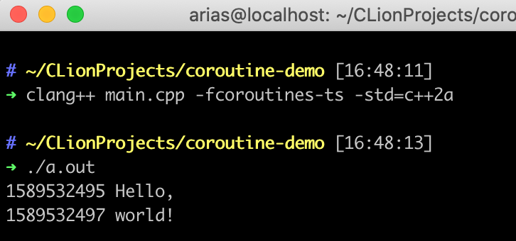

首先聊一聊上一篇文章中出现的两个结构体: `suspend_always`, `suspend_never`

打开 `<coroutine>`可以看到这两个结构体的源码是这样的

```c++
struct suspend_never {
  bool await_ready() const noexcept { return true; }
  void await_suspend(coroutine_handle<>) const noexcept {}
  void await_resume() const noexcept {}
};

struct suspend_always {
  bool await_ready() const noexcept { return false; }
  void await_suspend(coroutine_handle<>) const noexcept {}
  void await_resume() const noexcept {}
}
```

这俩玩意儿都有一样的3个成员函数`bool await_ready()`, `void await_suspend(coroutine_handle<>)`, `void await_resume()`. 在C++ 20的标准中, 拥有这3个成员函数的类型被称为`awaiter`类型. 


## `co_await <expr>`

知道什么是`awaiter`类型之后, 就能聊一聊`co_await`这个关键字了. `co_await`是一个一元运算符，通常情况下其操作数就是表达式`<expr>`的值, 称它为`awaitable`对象. 编译器在处理这个关键字时会添加一些代码来完成一系列的操作, 这些操作大概如下:

#### 获取`awaiter`对象

* 这一步的操作可以通过操作符重载完成. 

* 如果没有对应的重载函数则最后的`awaiter`为`awaitable`本身

* 这里可能就有人要晕了, 又是`awaiter`又是`awaitable`. 那我们来举个例子

  ```c++
  // include headers
  
  // using namespace
  
  /** class resumable {
  ...
  } **/
  
  resumable foo() {
    cout << "Hello, ";
    co_await async(launch::deferred, [](){
      this_thread::sleep_for(chrono::seconds(2));
    }); // 这里 async(...) 的值为 awaitable, 由于我们没有给future<void>重载 co_await 运算符
    		// 因此此处最后的 awaiter 对象就是 future<void>
    cout << "world!" << endl; 
  }
  
  ```

  但是`future<void>`不符合我们上文所说的`awaiter`类型的条件, 所以这个代码是没有办法编译的

  所以我们要让某个类型能够被 `co_await` 的方法有两种: 1. 为其实现`await_ready()` , `await_suspend(coroutine_handle<>)`,  `await_resume()` 3个成员函数使其成为一个满足条件的`awaiter`类型; 2. 为其重载 `operator co_await` 返回一个满足条件的`awaiter`类型

#### 处理`awaiter`对象

* 调用`awaiter.await_ready()`
* 若 `await_ready()` 的返回值为 `true` 则直接调用 `awaiter.await_resume()`. 调用结果为 `co_await <expr>`  的结果
* 若 `await_ready()` 的返回值为 `false`则会挂起协程, 然后调用 `awaiter.await_suspend(coroutine_handle<>)`.  最后返回至最初协程的调用者. 当协程被唤醒时(`coroutine_handle<>.resume()`函数被调用), 调用`awaiter.await_resume()`, 结果为`co_await <expr>`.


这些操作写成代码的形式大概如下:
```c++
{
  auto&& awaitable = <expr>;
  auto&& awaiter = get_awaiter(awaitable);
  if (!awaiter.await_ready())
  {
    using handle_t = std::experimental::coroutine_handle<Promise>;

    <suspend-coroutine>
    
    awaiter.await_suspend(handle_t::from_promise(p));
    <return-to-caller-or-resumer>
    
    <resume-point>
  }

  return awaiter.await_resume();
}
```
在`<suspend-coroutine>` 处, 编译器使用了魔法来将相关变量以及`resume-point`保存起来, 此时协程被视作挂起状态. 虽然协程被视作挂起, 但还返回至协程的调用者, 而是根据前篇文章的提到`promise_type`生成对应的`coroutine_handle<>` 作为参数继续调用`awaiter.await_suspend(coroutine_handle<>)`函数. 调用完成之后便返回至协程的调用者.

从上面的规则可以得出, 我们可以通过`awaiter.await_suspend(coroutine_handle<>)`函数, 来完成一些异步操作. 说了那么多, 就修改下上文 `future<void>` 的例子, 来实现一个类似其他语言协程的`delay`功能:

``` c++
// include headers

// using namespace

/** class resumable {
...
} **/

auto delay(int sec) {
  struct future_awaiter {
    future<void> f_;

    future_awaiter(future<void> &&f) : f_(move(f)) {}

    bool await_ready() noexcept {
      return false;
    }

    void await_suspend(coroutine_handle<> handle) noexcept {
      thread([&]() {
        f_.get();
        handle.resume();
      }).detach();
    }

    void await_resume() noexcept {}
  };

  return future_awaiter { async(launch::deferred, [=](){
    this_thread::sleep_for(chrono::seconds(sec));
  }) };
}

resumable foo() {
  using time = chrono::system_clock;
  
  cout << time::to_time_t(time::now()) << " Hello, " << endl;
  co_await delay(2);
  cout << time::to_time_t(time::now()) << " world!" << endl;
}

int main() {
  auto r = foo();
  r.resume();
  r.join(); // 防止main函数提前结束
}
```

编译运行这段代码



大功告成！


参考文献:

[1] [C++ Coroutines: Understanding operator co_await](https://lewissbaker.github.io/2017/11/17/understanding-operator-co-await)

[2] [Coroutines (C++20)](https://en.cppreference.com/w/cpp/language/coroutines)

